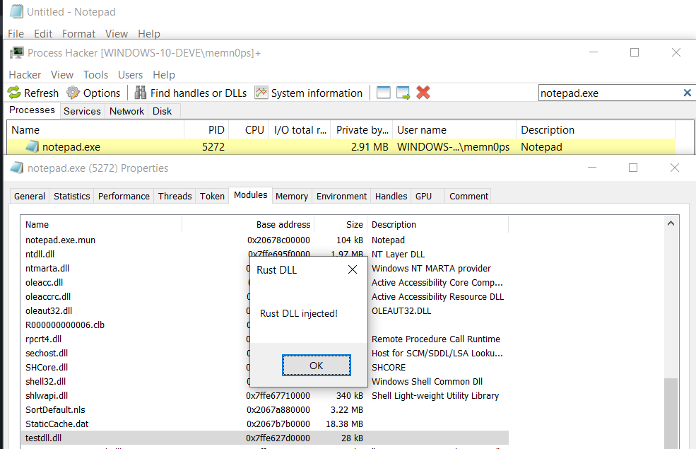

# Classic DLL Injection

Simple classic DLL Injector made for fun, practice, and for testing things. Check out my Manual Mapper in Rust: https://github.com/memN0ps/mmapper-rs or Shellcode Reflective DLL Injection in Rust: https://github.com/memN0ps/srdi-rs for alternatives.

## Usage

```
Usage: inject.exe <process> <dll path>
```

## Example

Enable logger (for debugging only)

```
PS C:\Users\memn0ps\Documents\Github\arsenal\dll_injector_classic-rs\target\debug> $env:RUST_LOG="info"
```

Inject DLL

```
PS C:\> .\inject.exe notepad.exe C:\Users\memn0ps\Documents\Github\arsenal\dll_injector_classic-rs\target\debug\testdll.dll

[2022-11-03T03:12:47Z INFO  inject] Process: notepad.exe
[2022-11-03T03:12:47Z INFO  inject] Path: C:\Users\memn0ps\Documents\Github\arsenal\dll_injector_classic-rs\target\debug\testdll.dll
[2022-11-03T03:12:47Z INFO  inject] Process ID: 5272
[2022-11-03T03:12:47Z INFO  inject] Allocated Memory: 0x2067a7b0000
[2022-11-03T03:12:47Z INFO  inject] Kernel32 Address: 0x7ffe67650000
[2022-11-03T03:12:47Z INFO  inject] LoadLibraryA address: 0x7ffe676704f0
[2022-11-03T03:12:47Z INFO  inject] Injection Complete!
```

DLL Injected

