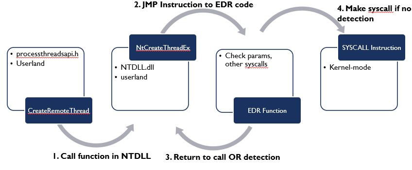
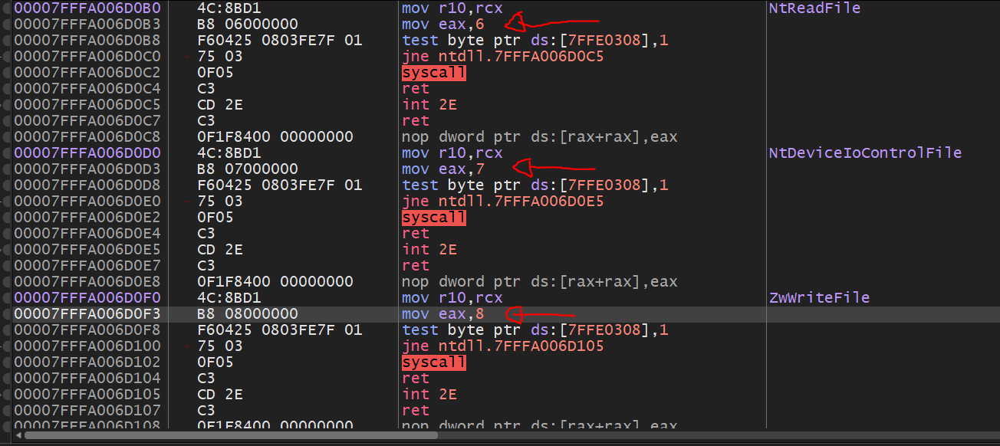
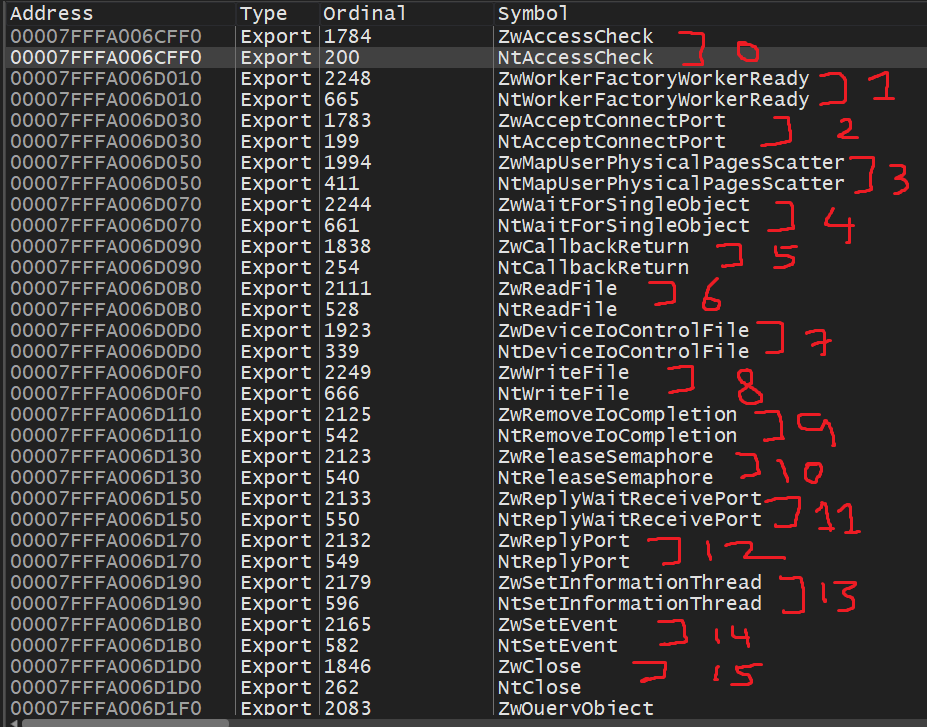

# Hell's Gate / Halo's Gate / Tartarus' Gate and FreshyCalls / SysWhispers1 / SysWhispers2 / SysWhispers3 in Rust

I named this project `Mordor` because Hell's Gate / Halo's Gate / Tartarus' Gate remind me of the [Black Gate of Mordor](https://shadowofwar.fandom.com/wiki/Black_Gate) in [The Lord of the Rings](https://en.wikipedia.org/wiki/The_Lord_of_the_Rings_(film_series)) for some weird reason haha and the project needs a cool name so why not?


**Credits to [Middle-earth: Shadow of War Wiki](https://shadowofwar.fandom.com/wiki/Black_Gate)**

## TODO

* Use an egghunter like Syswhispers3
* Add similar syscall functionality for `hells_halos_tartarus_gate`
* Add functionality in `hells_halos_tartarus_gate` to unhook if all function in `ntdll.dll` are hooked aka `Veles' Reek` at SEKTOR7. (I would just use `freshycalls_syswhispers` instead).

## Usage

The `morder-rs` project comes with 2 sub-projects called `freshycalls_syswhispers` and `hells_halos_tartarus_gate`. The difference between the Rust version of `freshycalls_syswhispers` and C/C++/Python version of `Syswhispers1/Syswhispers2/Syswhispers3` is that this project does not generate header/ASM files and output like it but utilizes the same techniques and is to be used as a library.

1. Add the library to your Rust `Cargo.toml` file by setting the git repository or local path and choosing the direct or indirect system call feature by setting `_DIRECT_` or `_INDIRECT_` as a feature. Please note you can only choose direct `_DIRECT_` or `_INDIRECT_` not both.

```toml
[dependencies]
freshycalls_syswhispers = { path = "../mordor-rs/freshycalls_syswhispers",  features = ["_DIRECT_"] }
```

```toml
[dependencies]
freshycalls_syswhispers = { path = "../mordor-rs/freshycalls_syswhispers",  features = ["_INDIRECT_"] }
```

or

```toml
[dependencies]
freshycalls_syswhispers = { git = "https://github.com/memN0ps/mordor-rs/tree/main/freshycalls_syswhispers", features = ["_DIRECT_"] }
```

```toml
[dependencies]
freshycalls_syswhispers = { git = "https://github.com/memN0ps/mordor-rs/tree/main/freshycalls_syswhispers", features = ["_INDIRECT_"] }
```

2. Make use of the library

```rust
use freshycalls_syswhispers;
```

3. Dynamically retrieve the `SSN` and/or `syscall` instruction from `ntdll.dll` even if functions are hooked and call any function using direct and/or indirect `syscall`. Note that when calling a function using the `syscall` macro the string will be obfuscated by hashing (`NtClose` in this example).

```rust
unsafe { syscall!("NtClose", process_handle) };
```

## Example

`Cargo.toml` file:

```toml
[package]
name = "testing-rs"
version = "0.1.0"
edition = "2021"

# See more keys and their definitions at https://doc.rust-lang.org/cargo/reference/manifest.html

[dependencies]
#freshycalls_syswhispers = { path = "../mordor-rs/freshycalls_syswhispers",  features = ["_DIRECT_"] }
freshycalls_syswhispers = { path = "../mordor-rs/freshycalls_syswhispers",  features = ["_INDIRECT_"] }

env_logger = "0.9.0"
log = "0.4.17"
sysinfo = "0.20.4"
obfstr = "0.3.0"
ntapi = { version = "0.4.0", features = ["impl-default"] }

[dependencies.windows-sys]
version = "0.36.1"
features = [
    "Win32_Foundation",
    "Win32_Security",
    "Win32_System_Threading",
    "Win32_UI_WindowsAndMessaging",
    "Win32_System_Memory",
    "Win32_System_Diagnostics_Debug",
    "Win32_System_SystemServices",
    "Win32_System_WindowsProgramming",
    "Win32_System_LibraryLoader",
]
```

`main.rs` file:

```rust
use std::{os::windows::raw::HANDLE, ptr::null_mut};

use freshycalls_syswhispers::{self, syscall, syscall_resolve::get_process_id_by_name};
use ntapi::{
    ntapi_base::CLIENT_ID,
    winapi::{
        shared::ntdef::{NT_SUCCESS, OBJECT_ATTRIBUTES},
        um::winnt::{PROCESS_VM_READ, PROCESS_VM_WRITE},
    },
};

fn main() {
    env_logger::init();

    let mut oa = OBJECT_ATTRIBUTES::default();

    let process_id = get_process_id_by_name("notepad.exe");
    let mut process_handle = process_id as HANDLE;

    let mut ci = CLIENT_ID {
        UniqueProcess: process_handle,
        UniqueThread: null_mut(),
    };

    let status = unsafe {
        syscall!(
            "NtOpenProcess",
            &mut process_handle,
            PROCESS_VM_WRITE | PROCESS_VM_READ,
            &mut oa,
            &mut ci
        )
    };

    log::debug!("status: {:#x}", status);

    if !NT_SUCCESS(status) {
        unsafe { syscall!("NtClose", process_handle) };
        panic!("Failed to get a handle to the target process");
    }

    log::debug!("Process Handle: {:?}", process_handle);
    unsafe { syscall!("NtClose", process_handle) };
}
```

## Unit Tests

The project has been tested with both `_DIRECT_` and `_INDIRECT_` system call features enabled and passed the unit tests even with hooks in place.

```toml
[features]
default = ["_INDIRECT_"]
```

```
$ cargo test
<...redacted...>
     Running unittests src\lib.rs (target\debug\deps\freshycalls_syswhispers-8106a187dc70ecbf.exe)

running 0 tests

test result: ok. 0 passed; 0 failed; 0 ignored; 0 measured; 0 filtered out; finished in 0.00s

     Running tests\syscaller.rs (target\debug\deps\syscaller-60e96237a57b1d9a.exe)

running 1 test
test tests::test_open_process ... ok

test result: ok. 1 passed; 0 failed; 0 ignored; 0 measured; 0 filtered out; finished in 0.37s

   Doc-tests freshycalls_syswhispers

running 0 tests

test result: ok. 0 passed; 0 failed; 0 ignored; 0 measured; 0 filtered out; finished in 0.00s
```

```toml
[features]
default = ["_DIRECT_"]
```

```
$ cargo test
<...redacted...>
     Running unittests src\lib.rs (target\debug\deps\freshycalls_syswhispers-7888fd45359c60a6.exe)

running 0 tests

test result: ok. 0 passed; 0 failed; 0 ignored; 0 measured; 0 filtered out; finished in 0.00s

     Running tests\syscaller.rs (target\debug\deps\syscaller-546ab9a58b0eaa56.exe)

running 1 test
test tests::test_open_process ... ok

test result: ok. 1 passed; 0 failed; 0 ignored; 0 measured; 0 filtered out; finished in 0.28s

   Doc-tests freshycalls_syswhispers

running 0 tests

test result: ok. 0 passed; 0 failed; 0 ignored; 0 measured; 0 filtered out; finished in 0.00s
```

## Description

### Hooking

Hooking is a technique used to intercept calls to pre-existing functions or redirect the execution flow of a legitimate API to another location in memory. This memory location could be controlled by an attacker, anti-virus (AV), end-point detection and response (EDR), or anti-cheat (AC).

`Inline Hooking:` This allows us to replace the targeted function's first few bytes (assembly instructions) with a jump instruction to redirect execution flow to another location in memory.

`Import Address Table Hooking (IAT hooking):` The Import Address table is a lookup table of function pointers for functions imported from DLLs or executables. IAT hooking allows us to replace the function address in the Import Address Table with another to redirect the program's execution flow.


**Credits to [Kyle Mistele](https://kylemistele.medium.com/a-beginners-guide-to-edr-evasion-b98cc076eb9a)**

### What is Hell's Gate / Halo's Gate / Tartarus' Gate?

Hell's Gate is a process injection technique that allows us to search for a number of bytes called the syscall stub, from the `ntdll.dll` module to extract the system call numbers and save them in a dedicated memory table, which is then used to call system APIs directly. However, the limitation of Hell's Gate is that it needs access to a clean `ntdll.dll` module if the functions are hooked. Otherwise, it cannot populate the needed syscall numbers and eventually fails to deliver native API calls. To address this problem, a twin sister was born called Halo's Gate, which is just a patch to Hell's Gate based on a very simple observation.

When a hooked is placed on a function (`jmp <address>`) we won't be able to dynamically retrieve the syscall numbers, so to address this problem we can look at the system call numbers of the neighboring functions and adjust the calculations accordingly to get our system call number, because syscall ID in the syscall stub follow each other incrementally.


Hell's Gate only checks for a sequence of bytes in the following order `4c8bd1b8`, which looks like this in assembly:

```asm
mov r10, rcx
mov eax, <syscall>
```

Halo's gate does the same as Hell's Gate but with an additional check to see if there is a hook in place by checking if the first byte of the export is `e9` (`jmp`) and if there is a hook in place then Halo's gate starts to look at the neighboring functions and adjust the calculations accordingly to get our system call number, since the syscall ID in the syscall stub follows each other incrementally.

However, not all EDRs hook in the same location (at the start of the function). What if EDRs hooks right after `mov r10, rcx` (`4c8bd1`)? This will break our code.

Tartarus' Gate solves this issue by adding an additional check to Halo's gate by searching for these bytes sequentially `4c8bd1e9` as well, which looks like this in assembly.

```asm
mov r10, rcx
jmp <address>
```

However, if all functions are hooked then we can find the first one and unhook all one by one starting from call ID 0. This method is called Veles' Reek at [SEKTOR7](https://www.sektor7.net/).

## FreshyCalls / SysWhispers1 / SysWhispers2 / SysWhispers3

The `FreshyCalls` technique searches the `Export Directory` for functions starting with `Nt` (excluding `Ntdll`) and sorts them by addresses. Surprisingly the lowest address is syscall number 0 and the next one will be syscall numbers 1 and 2 and 3... You can verify this in x64 dbg or Windbg yourself.

Syswhispers2 does the same thing but instead of searching for the `Nt` functions inside the export directory of  `ntdll.dll` it searches for functions starting with `Zw`. Surprisingly `Zw` functions and `Nt` functions point to the same syscall stubs and will have the same system call number.

Here we can verify that:





The difference between `Zw` anmd `Nt` functions are explained by [Microsoft here](https://learn.microsoft.com/en-us/windows-hardware/drivers/kernel/using-nt-and-zw-versions-of-the-native-system-services-routines):

"*The Windows native operating system services API is implemented as a set of routines that run in kernel mode. These routines have names that begin with the prefix Nt or Zw. Kernel-mode drivers can call these routines directly. User-mode applications can access these routines by using system calls.

With a few exceptions, each native system services routine has two slightly different versions that have similar names but different prefixes. For example, calls to NtCreateFile and ZwCreateFile perform similar operations and are, in fact, serviced by the same kernel-mode system routine.

For system calls from user mode, the Nt and Zw versions of a routine behave identically. For calls from a kernel-mode driver, the Nt and Zw versions of a routine differ in how they handle the parameter values that the caller passes to the routine.

A kernel-mode driver calls the Zw version of a native system services routine to inform the routine that the parameters come from a trusted, kernel-mode source. In this case, the routine assumes that it can safely use the parameters without first validating them. However, if the parameters might be from either a user-mode source or a kernel-mode source, the driver instead calls the Nt version of the routine, which determines, based on the history of the calling thread, whether the parameters originated in user mode or kernel mode*"


## In a nutshell:

`Hell's Gate:` This will parse `ntdll.dll` to find the starting of the syscall stub (`4c8bd1b8`) and then retrieve the syscall ID. However, if the syscall stub is hooked then our code will break.

`Halo's Gate:` The same as Hell’s Gate, but adds an additional check to see if the first hooks are in place by checking if the first byte is `e9` (`jmp`) and if there is a hook in place then Halo's gate starts to look at the neighboring functions and adjust the calculations accordingly to get our system call number since the syscall ID in the syscall stub follows each other incrementally.

`Tartarus' Gate`: The same Halo's Gate but adds an additional check to see if the syscall stub is hooked on the second line, after the assembly instructions `mov r10, rcx` by searching the following sequence of bytes: `4c8bd1e9.

`FreshyCalls:` This will search functions starting with `Nt` in the `Export Directory` and sorts them by addresses and the lowest address is the syscall identifier `0`.

`SysWhispers1:` Uses the OS version information to select the correct system call number.

`Syswhispers2:` The same as `FreshyCalls`, but this will search for `Zw` functions in the `Export Directory` and store the name by replacing `Zw` with `Nt`.

`SysWhispers3` This is very similar to `SysWhispers2` with the exception that it also supports x86/WoW64, syscalls instruction replacement with an EGG (to be dynamically replaced), direct jumps to syscalls in x86/x64 mode (in WOW64 it's almost standard), direct jumps to random syscalls (borrowing [@ElephantSeal's idea](https://twitter.com/ElephantSe4l/status/1488464546746540042)).

Exercise for the reader by: An excellent blog by [Alice Climent-Pommeret](https://alice.climent-pommeret.red/posts/direct-syscalls-hells-halos-syswhispers2/) and [Kelzvirus](https://klezvirus.github.io/RedTeaming/AV_Evasion/NoSysWhisper/)


## References and Credits

* https://github.com/am0nsec/HellsGate - [smelly__vx](https://twitter.com/smelly__vx) (@RtlMateusz) and Paul Laîné ([@am0nsec](https://twitter.com/am0nsec))
* https://vxug.fakedoma.in/papers/VXUG/Exclusive/HellsGate.pdf
* https://blog.sektor7.net/#!res/2021/halosgate.md - [@Reenz0h / @SEKTOR7net](https://twitter.com/SEKTOR7net)
* https://github.com/trickster0/TartarusGate ([trickster0 / @trickster012](https://twitter.com/trickster012))
* https://trickster0.github.io/posts/Halo's-Gate-Evolves-to-Tartarus-Gate/
* https://klezvirus.github.io/RedTeaming/AV_Evasion/NoSysWhisper/ [@KlezVirus](https://twitter.com/KlezVirus)
* https://www.mdsec.co.uk/2020/12/bypassing-user-mode-hooks-and-direct-invocation-of-system-calls-for-red-teams/ - [@modexpblog](https://twitter.com/modexpblog)
* https://github.com/janoglezcampos/rust_syscalls/ - [@httpyxel](https://twitter.com/httpyxel)
* https://kylemistele.medium.com/a-beginners-guide-to-edr-evasion-b98cc076eb9a - [@AliceCliment](https://twitter.com/AliceCliment)
* https://alice.climent-pommeret.red/posts/direct-syscalls-hells-halos-syswhispers2/
* https://github.com/crummie5/FreshyCalls - [@ElephantSe4l](https://twitter.com/ElephantSe4l)
* https://github.com/jthuraisamy/SysWhispers - [@Jackson_T](https://twitter.com/Jackson_T)
* https://github.com/jthuraisamy/SysWhispers2 - [@Jackson_T](https://twitter.com/Jackson_T)
* https://github.com/klezVirus/SysWhispers3 - [@klezVirus](https://twitter.com/KlezVirus)