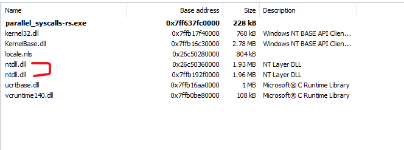

# ParallelSyscalls

Rust version of MDSec's ParallelSyscalls research: https://github.com/mdsecactivebreach/ParallelSyscalls/ and https://www.mdsec.co.uk/2022/01/edr-parallel-asis-through-analysis/

This code can be used to load a fresh copy of `NTDLL.dll` using system calls and extract system calls from the fresh copy of `NTDLL.dll` to call any Win32 API function of your choice. This may allow you to evade AV/EDR detections. Please note that the syscall stubs are allocated using `RWX` memory created using `VirtualAlloc()`, which is not optimal from an OPSEC perspective.

Writing a tool and a blog post by doing self-research has helped me learn a lot more than anything I've ever done: https://memn0ps.github.io/parallel-syscalls/

## Why Rust?

Why not? Rust is awesome! A low-level statically (compiled) and strongly typed systems programming language that is faster than C/C++, allowing you to achieve memory safety, concurrency and perform low-level tasks writing high-level code with an excellent compiler, community and documentation. I have moved away from my old favourite languages C/C++/C#, and started my new Rusty adventure.

This project has allowed me to learn about Rust Windows Internals and enhance my red teaming skills. I'm relatively new to Rust, but I firmly believe Rust is the future for robust programs, red teaming and malware development.

## Example

1. Import the "parallel_syscalls" library using `mod parallel_syscalls;`

2. Create a function pointer type such as `NtCreateThreadEx` https://docs.rs/ntapi/0.3.6/ntapi/ntpsapi/fn.NtCreateThreadEx.html

3. Call the function `get_module_base_address("ntdll")` to load a fresh copy of NTDLL using MDSec's Parallel Syscalls technique.

4. Call the function `get_function_address(ptr_ntdll, "NtCreateThreadEx")` and pass in NTDLL's base address

5. Call the function as you would normally `nt_create_thread_ex(&mut thread_handle, GENERIC_ALL, null_mut(), GetCurrentProcess(), null_mut(), null_mut(), 0, 0, 0, 0, null_mut())`

6. Profit \x90

## References

* https://www.mdsec.co.uk/2022/01/edr-parallel-asis-through-analysis/
* https://github.com/mdsecactivebreach/ParallelSyscalls/
* https://github.com/cube0x0/ParallelSyscalls/
* https://github.com/frkngksl/ParallelNimcalls/
* https://doc.rust-lang.org/book/
* https://github.com/microsoft/windows-rs
* https://crates.io/crates/ntapi
* https://crates.io/crates/winapi
* https://crates.io/crates/bstr
* https://twitter.com/MrUn1k0d3r (MrUn1k0d3r's Discord community / Waldo-IRC)
* https://github.com/felix-rs/ntcall-rs/ (Thanks felix-rs)
* https://github.com/Kudaes/DInvoke_rs
* https://github.com/kmanc/remote_code_oxidation
* https://github.com/zorftw/kdmapper-rs
* https://github.com/trickster0/OffensiveRust
* https://twitter.com/rustlang - (Rust Community Discord: Nick12#9400, B3NNY#8794, MaulingMonkey#1444, Zuix#4359, WithinRafael#7014, Jess Gaming#8850, madfrog#5492 and many more)

